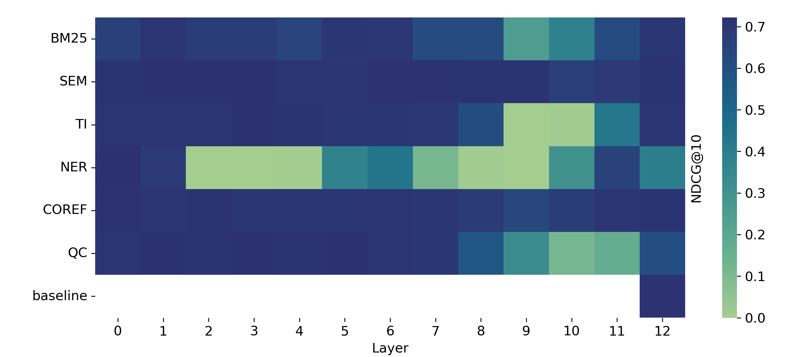

# Causal Probing

This project contains the code of my [masters thesis](Deconstructing_Retrieval_Abilities_of_LMs.pdf).

Results of causally probing TCT-ColBERT

Retrieval performance on the $43$ TREC test queries shown per task and intervention layer. The rank of the eliminated subspace is chosen as $k=8$ for NER, $k=4$ for QC, and $k=1$ for all other tasks.

## Project Setup

Setup Conda environment

```
conda create -n ma pyton=3.8
conda activate ma
pip install -r requirements
python -m spacy download en_core_wb_sm
```

### Installation of external repositories

trec evaluation

```
git clone https://github.com/usnistgov/trec_eval.git
cd trec_eval
make
```

ranking utils

```
git clone https://github.com/mrjleo/ranking-utils.git
cd ranking-utils
python -m pip install .
```

neuralcoref

```sh
git clone https://github.com/huggingface/neuralcoref.git
cd neuralcoref
pip install -r requirements.txt
pip install -e .
```

### Probing Datasets

The probing datasets for BM25, semantic similarity, NER, coreference resolution, and term importance were created using a [sister repository](https://github.com/Heyjuke58/tinse_probing_datasets) by sampling 60k query document pairs from the MSMARCO corpus.
For the question classification task, we used the available [dataset](https://cogcomp.seas.upenn.edu/Data/QA/QC/) of 5453 labeled questions by [Li and Roth](https://aclanthology.org/C02-1150/).


## Run Causal Probing

The core contribution of this work is understanding how large the impact of certain IR abilities is on the retrieval performance (Figure 7 in the paper). To reconstruct the causal probing results, you would have to run the following command for all IR abilities (BM25, TI, NER, ...) and for all layers of your subject model.

Example: Causally probe TCT-Colbert (=subject model) for task BM25 with intervention at layer 12. The intervention eliminates a subspace of rank 1.

```
python apply_intervention.py --layer=12 --eliminated_subspace_rank=1 --task=bm25 --model=tct_colbert
```

## Run Feasibility Study (Sanity Check)

Example: Sanity check experiment for task NER with intervention at layer 12. The intervention eliminates a subspace of rank 8.

```
python apply_intervention.py --layer=12 --eliminated_subspace_rank=8 --task=ner --model=tct_colbert --ablation=reconstruct_property
```

## Run Feasibility Study (Eliminating Subspace of Increasing Ranks)

Example: Subspace experiment for task NER with intervention at layer 12.

```
python apply_intervention.py --layer=12 --task=ner --model=tct_colbert --ablation=subspace_rank
```
